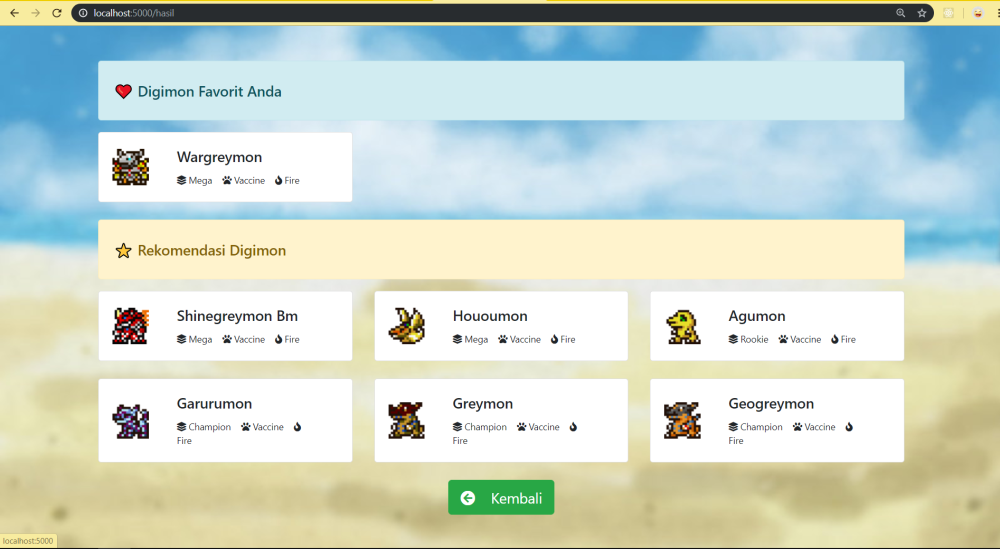

# Flask Exercises


#

                  

### **Soal 1 - Pokemon Battle**

Disediakan __beberapa dataset__ seputar data spesies Pokemon beserta history pertandingan antar Pokemon. File **_pokemon.csv_** berisi data lengkap 800 spesies Pokemon, sedangkan file _**combats.csv**_ berisi data historis duel Pokemon beserta pemenangnya. Unduh dataset langsung dari sumbernya: [klik sini](https://www.kaggle.com/sekarmg/pokemon).

Dengan dataset tersebut, buatlah sebuah __aplikasi Flask__ berisi model machine learning (model bebas) yang dapat memprediksi pemenang dari duel Pokemon. Aplikasi yang dibuat harus memenuhi syarat minimal berikut:

1. Server aplikasi akan berjalan di __localhost:5000__ dan ketika user melakukan GET request via browser akan tampil sebuah halaman __HTML__ sederhana yang memuat __2 buah text input__ dan __1 buah button__. Desain tampilan HTML tidak harus sama seperti contoh soal, utamakan fitur!

    

2. User dapat memasukkan nama Pokemon yang akan dipertandingkan ke dalam text input yang tersedia. Saat user menekan tombol button __'Battle!'__, aplikasi akan memproses data yang telah diinputkan oleh user.

    

3. Jika data sukses diproses, maka user akan di-_redirect_ ke __localhost:5000/hasil__ berisi halaman __HTML__ yang menampilkan: 
    
    - __Gambar Pokemon__
        - gunakan __Poke API__ ([_klik sini_](https://pokeapi.co/))
        - __GET__ ke https://pokeapi.co/api/v2/pokemon/{nama_Pokemon}

    - __Grafik perbandingan skill Pokemon__ (dari dataset): 
        - HP, 
        - Attack 
        - Defense 
        - Special Attack
        - Special Defense 
        - Speed

    - __Kemungkinan pemenang__ beserta __% probabilitasnya__

    Halaman ini juga dilengkapi __1 buah button__ untuk kembali ke halaman awal. Desain tampilan HTML tidak harus sama seperti contoh soal, utamakan fitur! Contoh:

    -   __Charmander vs Bulbasaur__ 

        

    -   __Pikachu vs Charizard__ 

        

    -   __Mewtwo vs Mew__ 

        
    
4. Namun jika data tidak ditemukan, tidak ada di dalam dataset atau user masuk ke url yang tidak tersedia, maka user akan di-redirect ke halaman __HTML__ yang memberikan informasi bahwa data tidak ditemukan, __error 404__. Halaman ini juga dilengkapi __1 buah button__ untuk kembali ke halaman awal. Desain tampilan HTML tidak harus sama seperti contoh soal, utamakan fitur!

    


_**Catatan:**_ _Lampiran jawaban dalam bentuk folder Battle_Pokemon yang sudah diupload_

#

## **Soal 2 - Pokemon Recommendation**

Disediakan sebuah dataset Pokemon: [unduh di sini](https://www.kaggle.com/abcsds/pokemon), beserta Pokemon API: [akses di sini](https://pokeapi.co/). Buatlah sebuah __*content-based filtering recommender system*__ dengan menggunakan __Flask__, yang dapat memfasilitasi user untuk menyebutkan Pokemon favoritnya & menyajikan rekomendasi __6 Pokemon__ berdasarkan feature: __Type 1__, __Generation__ & __Legendary__ Pokemon. Aplikasi yang dibuat harus memenuhi syarat minimal berikut:

1. Server aplikasi akan berjalan di __localhost:5000__ dan ketika user melakukan GET request via browser akan tampil sebuah halaman __HTML__ sederhana yang memuat __1 buah text input__ dan __1 buah button__. Desain tampilan HTML tidak harus sama seperti contoh soal, utamakan fitur!

    

2. User dapat memasukkan nama Pokemon favoritnya ke dalam text input yang sudah disediakan. Saat user menekan tombol __"Cari Pokemon"__, jika data ditemukan, maka user akan di-redirect ke __localhost:5000/hasil__ yang berisi halaman __HTML__, yang menampilkan data seputar Pokemon favorit user, disertai dengan data __6 Pokemon__ yang direkomendasikan berdasarkan __type__, __generasi__ & __legend__. Data yang ditampilkan untuk tiap Pokemon minimal: _nama_, _gambar_, _tipe_, _generasi_ & _legendary_. Gambar Pokemon tidak terdapat pada dataset, tapi dapat diambil dari [Pokemon API](https://pokeapi.co/). Halaman ini juga dilengkapi __1 buah button__ untuk kembali ke halaman awal. Desain tampilan HTML tidak harus sama seperti contoh soal, utamakan fitur!

    - Contoh jika user memfavoritkan __Pikachu__ :
    
        

        

    - Contoh jika user memfavoritkan __Pidgeotto__ :

        

        

4. Namun jika Pokemon favorit user tidak ditemukan, maka user akan di-redirect ke halaman __HTML__ yang memberikan informasi bahwa data tidak ditemukan. Halaman ini juga dilengkapi __1 buah button__ untuk kembali ke halaman awal. Desain tampilan HTML tidak harus sama seperti contoh soal, utamakan fitur!

    


_**Catatan:**_ _Lampiran jawaban dalam bentuk folder Pokemon_Recommend yang sudah diupload_

                  

#

                  
    

## **Soal 3 - Scraping Digimon to JSON**

Tersedia data lengkap __341 Digimon__ di laman [__DigiDB.io__](http://digidb.io/digimon-list/). Buatlah sebuah file __python (.py)__ dan gunakan teknik _web scraping_ untuk mengekstrak data di laman tersebut, kemudian _export_ semua data sebagai file __JSON (digimon.json)__ dengan struktur data sebagai berikut:

```javascript
...,
{
    "no": 46,
    "digimon": "Patamon",
    "image": "http://digidb.io/images/dot/dot096.png",
    "stage": "Rookie",
    "type": "Data",
    "attribute": "Wind",
    "memory": 4,
    "equip slots": 1,
    "hp": 880,
    "sp": 93,
    "atk": 79,
    "def": 74,
    "int": 92,
    "spd": 90
},
...
```

Ilustrasi dari proses yang diharapkan:


_**Catatan:**_ _Lampiran jawaban dalam bentuk folder Digimon_Scraping yang sudah diupload_

#

## **Soal 4 - Digimon Recommendation**

Dengan memanfaatkan file output __digimon.json__ dari _Soal 3_ di atas, buatlah sebuah __*content-based filtering recommender system*__ dengan menggunakan __aplikasi Flask__, yang dapat memfasilitasi user untuk menyebutkan Digimon favoritnya & menyajikan rekomendasi __6 Digimon__ berdasarkan feature: __stage__, __type__ & __attribute__ Digimon. Aplikasi yang dibuat harus memenuhi syarat minimal berikut:

1. Server aplikasi akan berjalan di __localhost:5000__ dan ketika user melakukan GET request via browser akan tampil sebuah halaman __HTML__ sederhana yang memuat __1 buah text input__ dan __1 buah button__. Desain tampilan HTML tidak harus sama seperti contoh soal, utamakan fitur!

    

2. User dapat memasukkan nama Digimon favoritnya ke dalam text input yang sudah disediakan. Saat user menekan tombol __"Submit"__, aplikasi akan mengambil data Digimon favorit user di file __digimon.json__. Jika data ditemukan, maka user akan di-redirect ke __localhost:5000/hasil__ yang berisi halaman __HTML__, yang menampilkan data seputar Digimon favorit user, disertai dengan data __6 Digimon__ yang direkomendasikan berdasarkan __stage__, __type__ & __attribute__-nya. Data yang ditampilkan untuk tiap Digimon minimal hanya: _nama_, _gambar_, _stage_, _type_ & _attribute Digimon_. Halaman ini juga dilengkapi __1 buah button__ untuk kembali ke halaman awal. Desain tampilan HTML tidak harus sama seperti contoh soal, utamakan fitur!

    - Contoh jika user memfavoritkan __Agumon__ :
    
        

        

    - Contoh jika user memfavoritkan __Wargreymon__ :

        

        

4. Namun jika Digimon favorit user tidak ditemukan atau tidak ada di dalam file __digimon.json__, maka user akan di-redirect ke halaman __HTML__ yang memberikan informasi bahwa data tidak ditemukan. Halaman ini juga dilengkapi __1 buah button__ untuk kembali ke halaman awal. Desain tampilan HTML tidak harus sama seperti contoh soal, utamakan fitur!

    

_**Catatan:**_ _Lampiran jawaban dalam bentuk folder Digimon_Recommend yang sudah diupload_

                  
    

#
